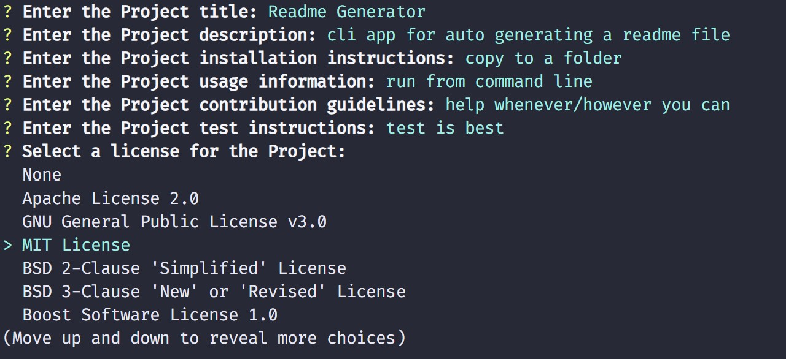

<!-- @format -->

# Readme Generator

A CLI app to automatically generate a readme markdown file.

## User Story

Given a base framework from which to generate a readme file, the requirement was to use the inquirer npm to prompt the user for questions, then use the user's answers to create a readme file.
The file was to contain a section for each of the user/s answers as well as a Table of Contents.

## Built With

- [VScode](https://code.visualstudio.com/) - The editor of choice

#### Initial interface

#### ToDo

Add functionality to check user input as entered to make some input (e.g. Title) required data.

### Licence

GNU General Public License v3.0

### Link to the github Repo

<a href="https://https://github.com/galluk/readme-generator">Readme Generator</a>

## Authors

- **Luke Gallagher** -
  luke.gallagher.cst@gmail.com
